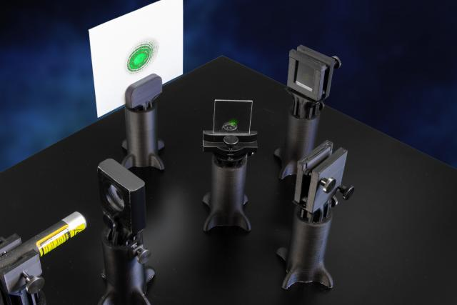
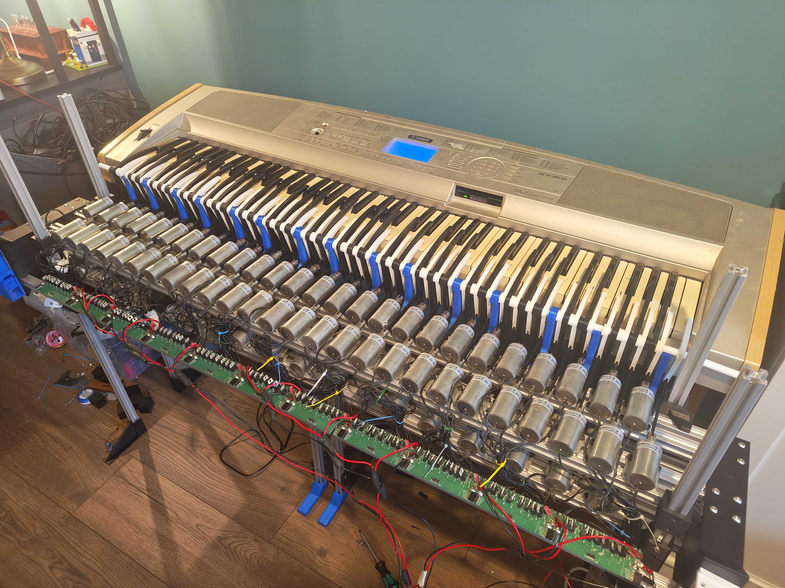
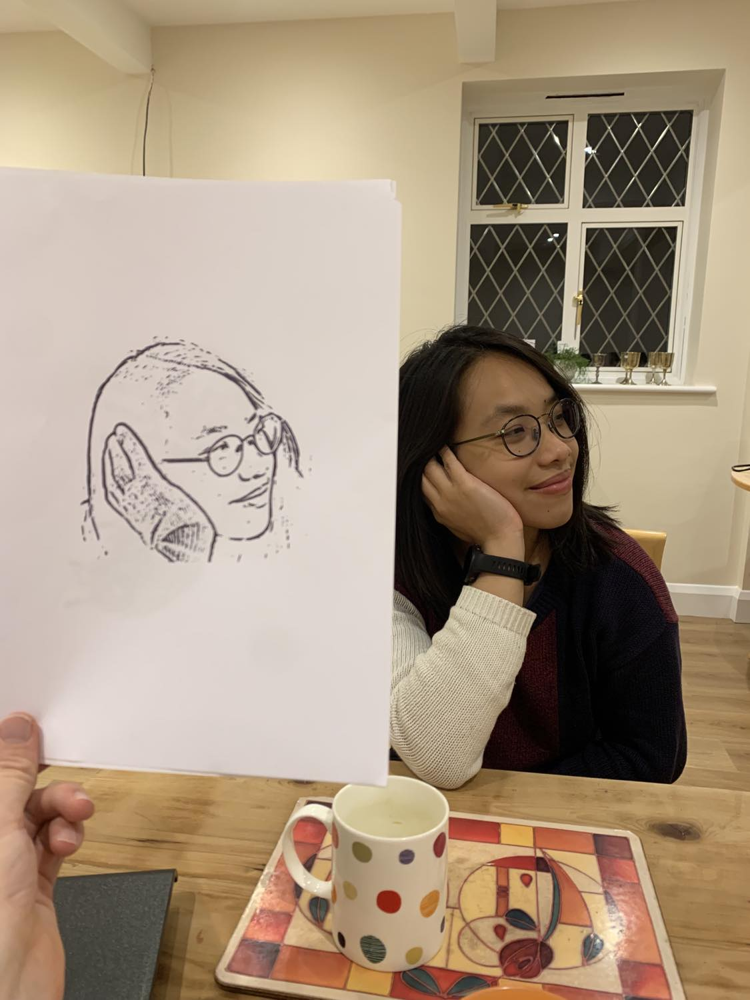

# Interferometer

  

  Here is the record of the interferometer I designed at CERN. Currently these tools cost £4000 and are tricky for even a scientist to set up. I redesigned it using a cheap laser pen and a 3D printer for only £40. They are super accurate measuring devices that are currently used to find gravity waves. Ours can measure the deflection of a piezo crystal down to 50nm (that is 2000x thinner than your hair). I helped run a workshop with kids and teachers to refine our instructions and set up templates; by the end of it kids were able to create a quantum eraser and prove for themselves that light doesn't actually move in a straight line in under ten minutes with no help. Importantly, what was usualy a dry and hard to explain physics lesson became, a super fun day they could independantly discover crazy stuff about the universe. [Here is the initial design and testing documentation and how that all works.](https://cds.cern.ch/record/2705782?ln=en) It is part of the science gateway outreach program in CERN, so if you are a school kid going on a trip there be prepared to make your own quantum waves! If you want the latest design to print your own, it lives [here!](https://scoollab.web.cern.ch/laserlab3D)

# The self playing piano "Tchaibotsky"

  

This is a piano that can compose music by itself and play it too! see if you can tell the difference between human and computer generated and performed art in this turing test: [here ;)](https://docs.google.com/forms/d/e/1FAIpQLSdsWYuC4zJo1RCfpW2OO7gJrU88cWlsbYe5tWjYFyxj3gjd-g/viewform)
Answers: 

Spoiler: Click to reveal
- Question 3 (top link) is a human. 
- Question 1 (bottom link) is Tchaibotsky. 
Was Tchaibotsky able to fool you? ;)

From the results of this test I concluded people couldn't tell the difference. I know ai music composition has come along way since my initial design. This was originally built in the year the attention is all you need paper came out and started transformers (type of algorithm in chatgpt), it uses one of the earliest implimentations of one. It can generate pieces around 2-3 minutes in length in the form of midi files and can even attempt to harmonise it with your own songs. This is built from 88 solenoid actuators. Originally it was made on breadboards and an old cupboard I found on the street for the frame! Now I have made some custom PCBs and an aluminium frame. It uses an Arduino with daisy chained shift registers that it sends fast PWM signals to transmit midi data to the fingers. For more details please read my [thesis](https://github.com/matthew-gratin/portfolio/blob/main/Tchaibotsky-2_compressed-1.pdf).

[I got featured on Tiffany Poon's podcast!](https://www.youtube.com/watch?v=dhRES9lAGE0)

I was asked to do the Oxford University Robotics Institute Christmas Lecture this year on the engineering design of Tchaibotsky and how musical maths is! You can listen to it playing some Christmas songs from the lecture by downloading the videos in the data folder.

  

# Robot Sister

  

It was my cousins wedding two years ago and my sister had to miss it as she was in New Zealand launching rockets at Rocket lab! My mission was to build a telepresence robot in 2 weeks to get her to the wedding. I made a 3 omniwheeled robot with camera, microphone and speaker. Made it stream the video feed to a webpage which she could use to SSH into the robot via a virtual local network and then control all the features simply through the web browser. She was able to dance the robot with everyone else and sing along to all the songs (with 1.2 seconds time delay). And before you ask, yes there was an evil robot voice mode.

She got a bit battered during the wedding!

  

# Wizard Chess

  

I was watching Harry Potter with some friends and thought they should have used practical effects for the scenes where Ron can make chess pieces move around the board with just his voice. My friends told me it would be impossible, so of course I needed to prove them wrong! There are 3 modes, player vs player, player vs computer and my personal favourite is computer vs computer. I coded the AI from scratch using markov decision trees. It only needs to look two moves ahead to beat me every time, I don't know what that says about me!
It uses an electromagnet on a 2 axes gantry to move the pieces to the desired locations. It used to connect to a google cloud server to offload the speech recognition system to Google's much bulkier computer than my NUC. This limited its commerical potential. However, with advances in AI, I can now run an offline deep learning Whisper model on a Pi 5, while a Teensy microcontroller deals with all the actuation. Features I want to develop are web access, so you can play against people online and connect to live chess streams where the wizard chess board would move its pieces as the professional players move theirs. My favourite thing to do at the moment is watch the CPU's play each other. I now have a client who wants this built as a coffee table to have Chess games play automatically under a mug of tea, I am slowly hoping to build this more often for others as I think it will be quite popular.

Github doesn't allow native videos but you can find some videos of it working in the data folder. But, if you want to have a game and see more you will need to bring me to the office! ;)

# The drawing machine. 

I wanted to make a painting for my girlfriend's birthday but I have no talent in art as I have no talent other than computer vision algorithms and robotics. She was happy with my robots art!

  

I built it from my old 3d printed CNC machine I made. Now I have a proper CNC it had become redundant to own a rubbishy one. I built an image to SVG to G-code converter that uses Canny edge detection, blob analysis and some post processing techniques to convert images, in multiple bespoke artistic ways, and then output gcode it sends to the machine.

  

I made a second version which I developed into a second year design module at Oxford University's engineering undergraduate course. I have also run it as part of a week long workshop for high school kids to learn engineering. Needless to say they loved making something with their own hands that they could use to make more interesting things.

  

# Brickify

  

This is brickify 1.0.1, it is my tool to convert pictures into lego mosaics. I have plans for more build features planned if demand is high (however I have done no promotion for this so I doubt it will be a priority until I want to make more lego mosaics myself).

If you want to try it out, the download it the link is [here.](http://www.mediafire.com/file/cdr427dj3cs7xna/Brickify-1.0.1.zip/file)

Here are some tips to explain how to use the software:

Common colours are colours that regularly have over 1000 bricks on bricklink available. Most colours are still avaiable and don't cost more than 2p, so are still viable but will potentially make an awkward order. Greyscale uses new lego grey colours (light grey and dark grey is discontinued)

Note that lego baseplates come in 48x48 and 32x32 configureations.

Dithering uses floyd steinbeck method, just makes them look better. The aspect ratio does what you would expect.

Saturation is between -255 and 255 for each colour - it offsets the image greater or lesser into that hue. I  use it to bias the image to certain lego bricks.

Saving a file also adds a text file to the directory, this contains the bricks you need to create that image and a link where to buy them.

Here is an example of a lego mosaic I made:

  

# Nixie tube clock

I have always been a fan of a metric time. That being 10 hours in a day, 100 minutes in an hour and 100 seconds in a minute. I'm surprised it never caught on! No clocks on the market have this feature, so I had to make one. It has a custom pcb for driving the ocsillator and high voltage tubes. I gave it three modes so it can be used as a boring normal clock too.

  

# To add to github:

Automatic Chopsticks

Orrery

Drone

# Currently building:

Ultra lightweight robot velociraptor with a capstan drive

